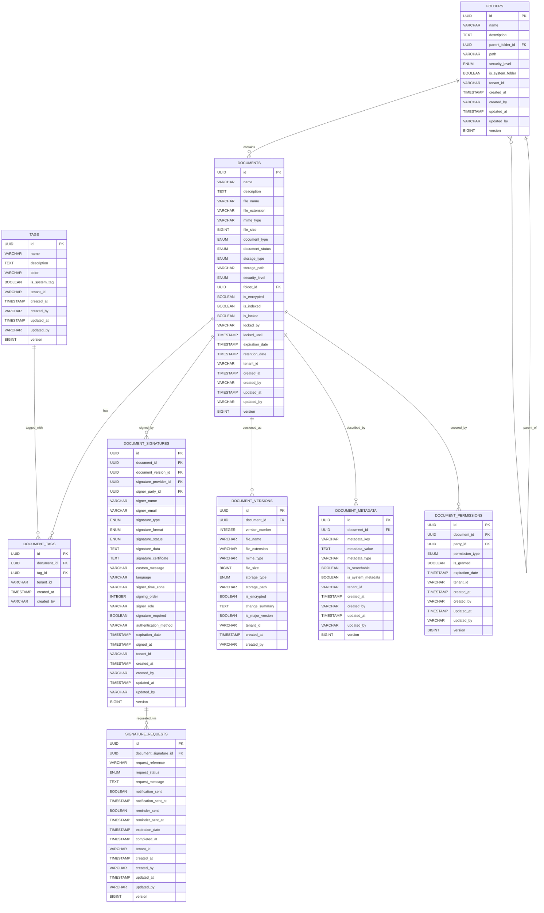

# Firefly OpenCore Platform - Document Management Microservice

[](https://opensource.org/licenses/Apache-2.0)
[](https://openjdk.java.net/)
[](https://spring.io/projects/spring-boot)
[](https://maven.apache.org/)

A comprehensive, enterprise-grade document management microservice built on Spring Boot WebFlux with reactive programming principles. This microservice is a core component of the **Firefly OpenCore Platform** - an open-source core banking solution that provides advanced document lifecycle management, digital signature capabilities, and seamless integration with the Firefly fireflyframework-ecm-core framework for financial institutions.

## Overview

The Document Management Microservice provides comprehensive Enterprise Content Management (ECM) capabilities through seamless integration with the fireflyframework-ecm-core library. It offers flexible deployment options from standalone document metadata management to full-featured ECM with cloud storage and digital signatures.

### Key Features

- **Document Lifecycle Management**: Complete CRUD operations with metadata, versioning, and audit trails
- **Digital Signatures**: Integration with e-signature providers (DocuSign, Adobe Sign) through fireflyframework-ecm-core
- **Multi-Cloud Storage**: Support for S3, Azure Blob Storage, and local file systems via ECM adapters
- **Hierarchical Organization**: Folder structure with inheritance-based permissions
- **Flexible Tagging**: Document categorization and search capabilities
- **Reactive Architecture**: Built with Spring WebFlux for high-performance, non-blocking operations
- **Graceful Degradation**: Works with or without ECM adapters configured

### ECM Integration Capabilities

The microservice leverages **fireflyframework-ecm-core** to provide:

- **EcmPortProvider**: Central access to ECM functionality through port-based architecture
- **DocumentContentPort**: Content storage and retrieval operations
- **DocumentVersionPort**: Version management and history tracking
- **SignatureRequestPort**: Digital signature workflow integration
- **SignatureEnvelopePort**: Signature envelope management

## Quick Start

### Prerequisites

- **Java 25+** - OpenJDK or Oracle JDK
- **Maven 3.6+** - Build tool
- **PostgreSQL 12+** - Database
- **Docker** (optional) - For containerized deployment

### 1. Clone and Build

```bash
git clone https://github.com/firefly-oss/core-common-document-mgmt.git
cd core-common-document-mgmt
mvn clean install
```

### 2. Database Setup

```sql
-- Create database
CREATE DATABASE firefly_ecm;

-- Create user (optional)
CREATE USER firefly_user WITH PASSWORD 'firefly_password';
GRANT ALL PRIVILEGES ON DATABASE firefly_ecm TO firefly_user;
```

### 3. Basic Configuration

Create `application-local.yml`:

```yaml
spring:
  r2dbc:
    url: r2dbc:postgresql://localhost:5432/firefly_ecm
    username: firefly_user
    password: firefly_password
  
  flyway:
    url: jdbc:postgresql://localhost:5432/firefly_ecm
    user: firefly_user
    password: firefly_password

# Business logic configuration
firefly:
  ecm:
    integration:
      signature:
        custom-message: "Please review and sign this document"
        language: "en"
        expiration-days: 30
      document:
        security-level: "INTERNAL"
        retention-days: 2555
```

### 4. Run the Application

```bash
cd core-common-document-mgmt-web
mvn spring-boot:run -Dspring-boot.run.profiles=local
```

The service will be available at `http://localhost:8080`

## Architecture

The microservice follows a modular, multi-module Maven architecture:

```
core-common-document-mgmt/
├── core-common-document-mgmt-web/          # REST API layer
├── core-common-document-mgmt-core/         # Business logic & services
├── core-common-document-mgmt-interfaces/   # DTOs & contracts
├── core-common-document-mgmt-models/       # JPA entities & repositories
└── core-common-document-mgmt-sdk/          # Client SDK
```

### Database Schema



### Technology Stack

- **Runtime**: Java 25+
- **Framework**: Spring Boot 3.x with WebFlux
- **Database**: PostgreSQL with R2DBC
- **Build**: Maven 3.6+
- **ECM Integration**: fireflyframework-ecm-core

## ECM Integration

### Deployment Scenarios

1. **Standalone**: Document metadata management without content storage
2. **Local Storage**: File system-based storage for development
3. **Cloud Storage**: Production-ready cloud storage (S3, Azure Blob)
4. **Full ECM**: Complete ECM functionality with all adapters

### ECM Configuration Example

```yaml
firefly:
  ecm:
    # Provider configuration (handled by fireflyframework-ecm-core)
    document-content:
      provider: s3
      s3:
        bucket: firefly-documents
        region: us-east-1
        access-key: ${AWS_ACCESS_KEY}
        secret-key: ${AWS_SECRET_KEY}
    
    signature:
      provider: docusign
      docusign:
        integration-key: ${DOCUSIGN_INTEGRATION_KEY}
        user-id: ${DOCUSIGN_USER_ID}
        account-id: ${DOCUSIGN_ACCOUNT_ID}
        base-path: https://demo.docusign.net/restapi
    
    # Business logic configuration (handled by microservice)
    integration:
      signature:
        custom-message: "Please review and sign this document"
        language: "en"
        expiration-days: 30
      document:
        security-level: "INTERNAL"
        retention-days: 2555
```

## Documentation

Comprehensive documentation is available in the [`docs/`](./docs/) directory:

- **[API Reference](./docs/api-reference.md)** - Complete REST API documentation with verified endpoints
- **[Architecture Guide](./docs/architecture.md)** - System architecture and ECM integration patterns
- **[Configuration Guide](./docs/configuration.md)** - Configuration options for all deployment scenarios
- **[Integration Overview](./docs/integration-overview.md)** - Complete fireflyframework-ecm-core integration guide
- **[Integration Examples](./docs/integration-examples.md)** - Practical code examples and use cases

## Development

### Running Tests

```bash
mvn test
```

### Building Docker Image

```bash
mvn clean package -DskipTests
docker build -t firefly/document-mgmt:latest .
```

### API Documentation

Quick reference of newly exposed endpoints (all responses are reactive streams or JSON objects):

- POST /api/v1/documents/search/filter (body: FilterRequest<DocumentDTO>)
- GET /api/v1/documents/{documentId}/permissions/check?principalId={uuid}&permission={READ|WRITE|...}

Example requests:

```bash
# Filter-based search (by name contains and mimeType equals)
curl -s -X POST "http://localhost:8080/api/v1/documents/search/filter" \
  -H "Content-Type: application/json" \
  -d '{
        "filters": [
          {"field": "name", "op": "CONTAINS", "value": "contract"},
          {"field": "mimeType", "op": "EQ", "value": "application/pdf"}
        ],
        "page": 0,
        "size": 20,
        "sort": [{"field":"createdAt","direction":"DESC"}]
      }'

# Permission check
curl -s "http://localhost:8080/api/v1/documents/{documentId}/permissions/check?principalId={principalId}&permission=READ"
```

When running locally, API documentation is available at:
- **Swagger UI**: http://localhost:8080/swagger-ui.html
- **OpenAPI Spec**: http://localhost:8080/v3/api-docs

## Health Checks

The service provides comprehensive health checks:

- **Overall Health**: `/actuator/health`
- **Database**: `/actuator/health/db`
- **ECM Integration**: `/actuator/health/ecm`

## Contributing

We welcome contributions to the Firefly OpenCore Platform! Please see our [Contributing Guidelines](CONTRIBUTING.md) for details on how to submit pull requests, report issues, and contribute to the project.

## License

This project is licensed under the Apache License 2.0 - see the [LICENSE](LICENSE) file for details.

## Support

- **Documentation**: [docs/](./docs/)
- **Issues**: [GitHub Issues](https://github.com/firefly-oss/core-common-document-mgmt/issues)
- **Community**: [Firefly Community](https://community.getfirefly.io)
- **Email**: dev@getfirefly.io

---

**Firefly OpenCore Platform** - Building the future of open-source core banking solutions.  
Visit us at [getfirefly.io](https://getfirefly.io) to learn more about our comprehensive financial technology platform.
