# Architecture Guide

System architecture and design patterns for the Firefly OpenCore Platform Document Management Microservice.

## Overview

The Document Management Microservice is built using modern reactive architecture principles with Spring Boot WebFlux. It follows a modular, multi-module Maven structure that provides clear separation of concerns and enables flexible deployment scenarios through fireflyframework-ecm-core integration.

## System Architecture Diagram

```mermaid
graph TB
    subgraph "Client Layer"
        WEB[Web Applications]
        API[API Clients]
        MOBILE[Mobile Apps]
        SDK[Java SDK Client]
    end

    subgraph "Document Management Microservice"
        subgraph "Web Module (core-common-document-mgmt-web)"
            CTRL_DOC[DocumentController]
            CTRL_SIG[DocumentSignatureController]
            CTRL_FOLDER[FolderController]
            CTRL_TAG[TagController]
            SEC[Security Configuration]
            OPENAPI[OpenAPI Documentation]
            APP[EnterpriseContentManagementApplication]
        end

        subgraph "Core Module (core-common-document-mgmt-core)"
            SVC_DOC[DocumentServiceImpl]
            SVC_SIG[DocumentSignatureServiceImpl]
            SVC_FOLDER[FolderServiceImpl]
            SVC_TAG[TagServiceImpl]
            MAPPER_DOC[DocumentMapper]
            MAPPER_SIG[DocumentSignatureMapper]
            MAPPER_FOLDER[FolderMapper]
            MAPPER_TAG[TagMapper]
            CONFIG[Configuration Classes]
        end

        subgraph "Interfaces Module (core-common-document-mgmt-interfaces)"
            DTO_DOC[DocumentDTO]
            DTO_SIG[DocumentSignatureDTO]
            DTO_FOLDER[FolderDTO]
            DTO_TAG[TagDTO]
            ENUM[Enums & Constants]
            IFACE[Service Interfaces]
        end

        subgraph "Models Module (core-common-document-mgmt-models)"
            ENTITY_DOC[Document Entity]
            ENTITY_SIG[DocumentSignature Entity]
            ENTITY_FOLDER[Folder Entity]
            ENTITY_TAG[Tag Entity]
            ENTITY_META[DocumentMetadata Entity]
            ENTITY_PERM[DocumentPermission Entity]
            REPO_DOC[DocumentRepository]
            REPO_SIG[DocumentSignatureRepository]
            REPO_FOLDER[FolderRepository]
            REPO_TAG[TagRepository]
        end

        subgraph "SDK Module (core-common-document-mgmt-sdk)"
            CLIENT[DocumentManagementClient]
            BUILDER[Request Builders]
            SDK_CONFIG[SDK Configuration]
        end
    end

    subgraph "fireflyframework-ecm-core Integration"
        PROVIDER[EcmPortProvider]
        CONTENT_PORT[DocumentContentPort]
        SIGNATURE_PORT[SignatureRequestPort]
        SEARCH_PORT[DocumentSearchPort]
    end

    subgraph "ECM Adapters (Optional)"
        S3[S3 Adapter]
        AZURE[Azure Blob Adapter]
        LOCAL[Local FS Adapter]
        DOCUSIGN[DocuSign Adapter]
        ADOBE[Adobe Sign Adapter]
    end

    subgraph "External Systems"
        S3_CLOUD[Amazon S3]
        AZURE_CLOUD[Azure Blob Storage]
        FS[File System]
        DOCUSIGN_API[DocuSign API]
        ADOBE_API[Adobe Sign API]
        SEARCH_ENGINE[Search Engine]
    end

    subgraph "Data Layer"
        POSTGRES[(PostgreSQL Database)]
        FLYWAY[Flyway Migrations]
    end

    subgraph "Infrastructure"
        ACTUATOR[Spring Actuator]
        METRICS[Micrometer Metrics]
        LOGGING[Logback Logging]
        HEALTH[Health Checks]
    end

    %% Client connections
    WEB --> CTRL_DOC
    API --> CTRL_DOC
    MOBILE --> CTRL_DOC
    SDK --> CLIENT

    %% Controller to Service connections
    CTRL_DOC --> SVC_DOC
    CTRL_SIG --> SVC_SIG
    CTRL_FOLDER --> SVC_FOLDER
    CTRL_TAG --> SVC_TAG

    %% Service to Repository connections
    SVC_DOC --> REPO_DOC
    SVC_SIG --> SVC_DOC
    SVC_SIG --> REPO_SIG
    SVC_FOLDER --> REPO_FOLDER
    SVC_TAG --> REPO_TAG

    %% Service to Mapper connections
    SVC_DOC --> MAPPER_DOC
    SVC_SIG --> MAPPER_SIG
    SVC_FOLDER --> MAPPER_FOLDER
    SVC_TAG --> MAPPER_TAG

    %% Mapper connections
    MAPPER_DOC --> DTO_DOC
    MAPPER_DOC --> ENTITY_DOC
    MAPPER_SIG --> DTO_SIG
    MAPPER_SIG --> ENTITY_SIG
    MAPPER_FOLDER --> DTO_FOLDER
    MAPPER_FOLDER --> ENTITY_FOLDER
    MAPPER_TAG --> DTO_TAG
    MAPPER_TAG --> ENTITY_TAG

    %% ECM Integration
    SVC_DOC --> PROVIDER
    SVC_SIG --> PROVIDER
    PROVIDER --> CONTENT_PORT
    PROVIDER --> SIGNATURE_PORT
    PROVIDER --> SEARCH_PORT

    %% ECM Adapter connections
    CONTENT_PORT -.-> S3
    CONTENT_PORT -.-> AZURE
    CONTENT_PORT -.-> LOCAL
    SIGNATURE_PORT -.-> DOCUSIGN
    SIGNATURE_PORT -.-> ADOBE
    SEARCH_PORT -.-> SEARCH_ENGINE

    %% External system connections
    S3 --> S3_CLOUD
    AZURE --> AZURE_CLOUD
    LOCAL --> FS
    DOCUSIGN --> DOCUSIGN_API
    ADOBE --> ADOBE_API

    %% Data connections
    REPO_DOC --> POSTGRES
    REPO_SIG --> POSTGRES
    REPO_FOLDER --> POSTGRES
    REPO_TAG --> POSTGRES
    FLYWAY --> POSTGRES

    %% Infrastructure connections
    APP --> ACTUATOR
    APP --> METRICS
    APP --> LOGGING
    APP --> HEALTH

    %% SDK connections
    CLIENT --> BUILDER
    CLIENT --> SDK_CONFIG

    %% Styling
    classDef clientStyle fill:#e1f5fe,stroke:#01579b,stroke-width:2px
    classDef webStyle fill:#f3e5f5,stroke:#4a148c,stroke-width:2px
    classDef coreStyle fill:#e8f5e8,stroke:#1b5e20,stroke-width:2px
    classDef interfaceStyle fill:#fff3e0,stroke:#e65100,stroke-width:2px
    classDef modelStyle fill:#fce4ec,stroke:#880e4f,stroke-width:2px
    classDef sdkStyle fill:#e0f2f1,stroke:#004d40,stroke-width:2px
    classDef ecmStyle fill:#f1f8e9,stroke:#33691e,stroke-width:2px
    classDef adapterStyle fill:#fff8e1,stroke:#ff6f00,stroke-width:2px
    classDef externalStyle fill:#fafafa,stroke:#424242,stroke-width:2px
    classDef dataStyle fill:#e3f2fd,stroke:#0d47a1,stroke-width:2px
    classDef infraStyle fill:#f9fbe7,stroke:#827717,stroke-width:2px

    class WEB,API,MOBILE,SDK clientStyle
    class CTRL_DOC,CTRL_SIG,CTRL_FOLDER,CTRL_TAG,SEC,OPENAPI,APP webStyle
    class SVC_DOC,SVC_SIG,SVC_FOLDER,SVC_TAG,MAPPER_DOC,MAPPER_SIG,MAPPER_FOLDER,MAPPER_TAG,CONFIG coreStyle
    class DTO_DOC,DTO_SIG,DTO_FOLDER,DTO_TAG,ENUM,IFACE interfaceStyle
    class ENTITY_DOC,ENTITY_SIG,ENTITY_FOLDER,ENTITY_TAG,ENTITY_META,ENTITY_PERM,REPO_DOC,REPO_SIG,REPO_FOLDER,REPO_TAG modelStyle
    class CLIENT,BUILDER,SDK_CONFIG sdkStyle
    class PROVIDER,CONTENT_PORT,SIGNATURE_PORT,SEARCH_PORT ecmStyle
    class S3,AZURE,LOCAL,DOCUSIGN,ADOBE adapterStyle
    class S3_CLOUD,AZURE_CLOUD,FS,DOCUSIGN_API,ADOBE_API,SEARCH_ENGINE externalStyle
    class POSTGRES,FLYWAY dataStyle
    class ACTUATOR,METRICS,LOGGING,HEALTH infraStyle
```



## Module Structure

```
core-common-document-mgmt/
├── core-common-document-mgmt-web/          # REST API & Web Layer
├── core-common-document-mgmt-core/         # Business Logic & Services
├── core-common-document-mgmt-interfaces/   # DTOs & Service Contracts
├── core-common-document-mgmt-models/       # JPA Entities & Repositories
└── core-common-document-mgmt-sdk/          # Client SDK
```

### Module Responsibilities

#### Web Module (`-web`)
- **REST Controllers**: Reactive REST endpoints using Spring WebFlux
- **Security Configuration**: Authentication and authorization setup
- **OpenAPI Documentation**: Swagger/OpenAPI specification
- **Application Bootstrap**: Main Spring Boot application class

#### Core Module (`-core`)
- **Service Layer**: Business logic implementation
- **ECM Integration**: fireflyframework-ecm-core port usage and graceful degradation
- **MapStruct Mappers**: Entity-DTO mapping
- **Configuration Classes**: Business logic configuration

#### Interfaces Module (`-interfaces`)
- **DTOs**: Data Transfer Objects for API contracts
- **Enums**: Business domain enumerations
- **Service Interfaces**: Contract definitions

#### Models Module (`-models`)
- **JPA Entities**: Database entity definitions
- **R2DBC Repositories**: Reactive database access
- **Database Migrations**: Flyway migration scripts

#### SDK Module (`-sdk`)
- **Client SDK**: Java client for consuming the API
- **Request Builders**: Fluent API for building requests

## Technology Stack

| Component | Technology | Version | Purpose |
|-----------|------------|---------|---------|
| **Runtime** | Java | 21+ | Application runtime |
| **Framework** | Spring Boot | 3.x | Application framework |
| **Reactive** | Spring WebFlux | 6.x | Non-blocking web stack |
| **Database** | PostgreSQL | 12+ | Primary data store |
| **Database Access** | R2DBC | 1.x | Reactive database connectivity |
| **Migrations** | Flyway | 9.x | Database schema management |
| **Build Tool** | Maven | 3.6+ | Build and dependency management |
| **ECM Integration** | fireflyframework-ecm-core | Latest | ECM functionality |
| **Mapping** | MapStruct | 1.5+ | Entity-DTO mapping |
| **Documentation** | OpenAPI 3 | 3.x | API documentation |

## ECM Integration Architecture

### Port-Based Architecture

The microservice integrates with fireflyframework-ecm-core through a port-based architecture that provides clean separation between business logic and ECM provider implementations:

```
┌─────────────────────────────────────┐
│     Document Management Service     │
├─────────────────────────────────────┤
│           EcmPortProvider           │
├─────────────────────────────────────┤
│  DocumentContentPort                │
│  DocumentVersionPort                │
│  SignatureRequestPort               │
│  SignatureEnvelopePort              │
├─────────────────────────────────────┤
│         fireflyframework-ecm-core                │
├─────────────────────────────────────┤
│    ECM Adapters (Optional)          │
│  ┌─────────┐ ┌─────────┐ ┌─────────┐│
│  │   S3    │ │DocuSign │ │  Azure  ││
│  │Adapter  │ │ Adapter │ │ Adapter ││
│  └─────────┘ └─────────┘ └─────────┘│
└─────────────────────────────────────┘
```

### ECM Ports

#### DocumentContentPort
- **Purpose**: Content storage and retrieval operations
- **Methods**:
  - `storeContent(UUID documentId, byte[] content, String filename)`
  - `getContentStream(UUID documentId)`
  - `deleteContent(UUID documentId)`

#### DocumentVersionPort
- **Purpose**: Document version management
- **Methods**:
  - `createVersion(DocumentVersion version, byte[] content)`
  - `deleteVersion(UUID versionId)`

#### SignatureRequestPort
- **Purpose**: Digital signature request management
- **Methods**:
  - `createSignatureRequest(UUID signatureId, UUID documentId, String signerEmail, String signatureType)`
  - `deleteSignatureRequest(UUID signatureRequestId)`

#### SignatureEnvelopePort
- **Purpose**: Signature envelope management
- **Methods**:
  - `createEnvelope(SignatureEnvelope envelope)`
  - `getEnvelopeStatus(UUID envelopeId)`

## Data Architecture

### Database Schema

```sql
-- Core document entity
CREATE TABLE documents (
    id UUID PRIMARY KEY,
    name VARCHAR(255) NOT NULL,
    document_type VARCHAR(50) NOT NULL,
    security_level VARCHAR(50) NOT NULL,
    version INTEGER DEFAULT 1,
    file_name VARCHAR(255),
    mime_type VARCHAR(100),
    content_path VARCHAR(500),
    created_at TIMESTAMP NOT NULL,
    created_by VARCHAR(255) NOT NULL,
    updated_at TIMESTAMP,
    updated_by VARCHAR(255)
);

-- Folder hierarchy
CREATE TABLE folders (
    id UUID PRIMARY KEY,
    name VARCHAR(255) NOT NULL,
    description TEXT,
    parent_folder_id UUID REFERENCES folders(id),
    created_at TIMESTAMP NOT NULL,
    created_by VARCHAR(255) NOT NULL
);

-- Document-folder relationships
CREATE TABLE document_folders (
    document_id UUID REFERENCES documents(id),
    folder_id UUID REFERENCES folders(id),
    PRIMARY KEY (document_id, folder_id)
);

-- Tagging system
CREATE TABLE tags (
    id UUID PRIMARY KEY,
    name VARCHAR(100) UNIQUE NOT NULL,
    description TEXT,
    color VARCHAR(7)
);

-- Document-tag relationships
CREATE TABLE document_tags (
    document_id UUID REFERENCES documents(id),
    tag_id UUID REFERENCES tags(id),
    PRIMARY KEY (document_id, tag_id)
);

-- Signature requests
CREATE TABLE signature_requests (
    id UUID PRIMARY KEY,
    document_id UUID REFERENCES documents(id),
    signer_email VARCHAR(255) NOT NULL,
    signature_type VARCHAR(50) NOT NULL,
    signature_status VARCHAR(50) NOT NULL,
    external_request_id VARCHAR(255),
    created_at TIMESTAMP NOT NULL
);
```

### Entity Relationships

```
Document (1) ←→ (N) DocumentFolder (N) ←→ (1) Folder
Document (1) ←→ (N) DocumentTag (N) ←→ (1) Tag
Document (1) ←→ (N) SignatureRequest
Folder (1) ←→ (N) Folder (self-referencing hierarchy)
```

## Service Layer Architecture

### Service Implementation Pattern

```java
@Service
@Transactional
public class DocumentServiceImpl implements DocumentService {
    
    private final DocumentRepository repository;
    private final DocumentMapper mapper;
    private final EcmPortProvider ecmPortProvider;
    
    @Override
    public Mono<DocumentDTO> uploadContent(UUID documentId, FilePart filePart) {
        return repository.findById(documentId)
            .flatMap(document -> {
                return ecmPortProvider.getDocumentContentPort()
                    .map(port -> processWithEcm(document, filePart, port))
                    .orElseThrow(() -> new RuntimeException(
                        "Document content upload requires ECM DocumentContentPort to be configured"));
            });
    }
}
```

### Graceful Degradation Pattern

The service implements graceful degradation when ECM ports are not available:

```java
public Mono<DocumentDTO> createSignatureRequest(SignatureRequestDTO request) {
    return repository.findById(request.getDocumentId())
        .flatMap(document -> {
            SignatureRequest signatureRequest = mapper.toEntity(request);
            
            return ecmPortProvider.getSignatureRequestPort()
                .map(port -> {
                    // ECM available - create external signature request
                    return port.createSignatureRequest(...)
                        .map(externalId -> {
                            signatureRequest.setExternalRequestId(externalId);
                            signatureRequest.setSignatureStatus(SignatureStatus.SENT);
                            return signatureRequest;
                        });
                })
                .orElseGet(() -> {
                    // ECM unavailable - store request locally
                    signatureRequest.setSignatureStatus(SignatureStatus.PENDING);
                    return Mono.just(signatureRequest);
                })
                .flatMap(repository::save)
                .map(mapper::toDTO);
        });
}
```

## Configuration Architecture

### Configuration Separation

The microservice maintains clear separation between business logic and ECM provider configuration:

#### Business Logic Configuration (`firefly.ecm.integration.*`)
```java
@ConfigurationProperties(prefix = "firefly.ecm.integration")
@Data
public class EcmIntegrationProperties {
    private SignatureConfig signature = new SignatureConfig();
    private DocumentConfig document = new DocumentConfig();
    
    @Data
    public static class SignatureConfig {
        private String customMessage = "Please review and sign this document";
        private String language = "en";
        private String signerRole = "Signer";
        private int expirationDays = 30;
    }
    
    @Data
    public static class DocumentConfig {
        private String securityLevel = "INTERNAL";
        private int retentionDays = 2555;
    }
}
```

#### ECM Provider Configuration (`firefly.ecm.*`)
Handled by fireflyframework-ecm-core for ECM adapter configuration.

## Deployment Architecture

### Deployment Scenarios

1. **Standalone Deployment**
   - No ECM adapters configured
   - Document metadata management only
   - Graceful error messages for ECM operations

2. **Local Storage Deployment**
   - fireflyframework-ecm-adapter-local configured
   - File system storage for documents
   - Local signature simulation

3. **Cloud Storage Deployment**
   - fireflyframework-ecm-adapter-s3 or fireflyframework-ecm-adapter-azure
   - Cloud-based document storage
   - Production-ready scalability

4. **Full ECM Deployment**
   - Multiple adapters configured
   - Complete ECM functionality
   - Enterprise-grade capabilities

### Container Architecture

```dockerfile
FROM openjdk:21-jre-slim

WORKDIR /app
COPY target/core-common-document-mgmt-web-*.jar app.jar

EXPOSE 8080
ENTRYPOINT ["java", "-jar", "app.jar"]
```

## Security Architecture

### Authentication & Authorization
- Multi-tenant support with tenant isolation
- Role-based access control (RBAC)
- Document-level permissions
- Folder-based permission inheritance

### Data Protection
- Encryption in transit (HTTPS/TLS)
- Encryption at rest (database and ECM storage)
- Secure credential management
- Audit logging for compliance

## Monitoring & Observability

### Health Checks
- Database connectivity monitoring
- ECM port availability monitoring
- Custom health indicators

### Metrics
- Micrometer integration for metrics collection
- ECM operation timing and success rates
- Database connection pool monitoring
- JVM metrics

### Logging
- Structured logging with Logback
- ECM operation logging
- Error tracking and alerting
- Performance monitoring

## Performance Considerations

### Reactive Programming
- Non-blocking I/O operations
- Efficient resource utilization
- Proper backpressure handling
- Streaming for large file operations

### Caching Strategy
- Document metadata caching
- ECM port availability caching
- Configuration caching
- Database query result caching

### Scalability
- Horizontal scaling support
- Stateless service design
- Database connection pooling
- ECM adapter connection management
