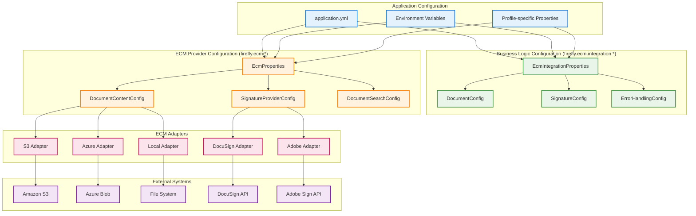

# Configuration Guide

Complete configuration reference for the Firefly OpenCore Platform Document Management Microservice.

## Configuration Overview

The microservice uses a two-tier configuration approach:

1. **Business Logic Configuration** (`firefly.ecm.integration.*`) - Managed by the microservice
2. **ECM Provider Configuration** (`firefly.ecm.*`) - Managed by fireflyframework-ecm-core

This separation ensures clean architecture and prevents configuration conflicts.

### Configuration Hierarchy



## Database Configuration

### PostgreSQL with R2DBC

```yaml
spring:
  r2dbc:
    url: r2dbc:postgresql://localhost:5432/firefly_ecm
    username: firefly_user
    password: ${DB_PASSWORD:firefly_password}
    pool:
      initial-size: 10
      max-size: 20
      max-idle-time: 30m
      validation-query: SELECT 1

  flyway:
    url: jdbc:postgresql://localhost:5432/firefly_ecm
    user: firefly_user
    password: ${DB_PASSWORD:firefly_password}
    locations: classpath:db/migration
    baseline-on-migrate: true
```

### Environment Variables

```bash
# Database configuration
export DB_HOST=localhost
export DB_PORT=5432
export DB_NAME=firefly_ecm
export DB_USERNAME=firefly_user
export DB_PASSWORD=secure_password
export DB_SSL_MODE=require
```

## Business Logic Configuration

### Document Management Settings

```yaml
firefly:
  ecm:
    integration:
      document:
        security-level: "INTERNAL"        # Default security level for new documents
        retention-days: 2555              # Default retention period (7 years)
        max-file-size: 50MB               # Maximum file size for uploads
        allowed-mime-types:               # Allowed MIME types
          - "application/pdf"
          - "application/msword"
          - "application/vnd.openxmlformats-officedocument.wordprocessingml.document"
          - "image/jpeg"
          - "image/png"
      
      signature:
        custom-message: "Please review and sign this document"
        language: "en"                    # Default language for signature requests
        signer-role: "Signer"            # Default signer role
        expiration-days: 30              # Default expiration for signature requests
        reminder-days: 7                 # Days before sending reminder
        
      error-handling:
        fail-fast: false                 # Continue operation when ECM unavailable
        log-failures: true               # Log ECM operation failures
        retry-attempts: 3                # Number of retry attempts for ECM operations
```

### Security Configuration

```yaml
firefly:
  security:
    cors:
      allowed-origins:
        - "https://app.getfirefly.io"
        - "https://admin.getfirefly.io"
        - "http://localhost:3000"        # Development frontend
      allowed-methods:
        - GET
        - POST
        - PUT
        - DELETE
        - OPTIONS
      allowed-headers: "*"
      allow-credentials: true
      max-age: 3600
```

## ECM Provider Configuration

### Document Content Storage

#### Amazon S3 Configuration

```yaml
firefly:
  ecm:
    document-content:
      provider: s3
      s3:
        bucket: firefly-documents-prod
        region: us-east-1
        access-key: ${AWS_ACCESS_KEY}
        secret-key: ${AWS_SECRET_KEY}
        endpoint: ${AWS_S3_ENDPOINT:}     # Optional for S3-compatible services
        path-style-access: false         # Use virtual-hosted-style URLs
```

**Required Dependencies:**
```xml
<dependency>
    <groupId>com.firefly</groupId>
    <artifactId>fireflyframework-ecm-adapter-s3</artifactId>
    <version>${firefly.version}</version>
</dependency>
```

#### Azure Blob Storage Configuration

```yaml
firefly:
  ecm:
    document-content:
      provider: azure
      azure:
        account-name: ${AZURE_STORAGE_ACCOUNT}
        account-key: ${AZURE_STORAGE_KEY}
        container-name: firefly-documents
        endpoint: https://${AZURE_STORAGE_ACCOUNT}.blob.core.windows.net
```

**Required Dependencies:**
```xml
<dependency>
    <groupId>com.firefly</groupId>
    <artifactId>fireflyframework-ecm-adapter-azure</artifactId>
    <version>${firefly.version}</version>
</dependency>
```

#### Local File System Configuration

```yaml
firefly:
  ecm:
    document-content:
      provider: local
      local:
        base-path: ./documents
        create-directories: true
        preserve-file-structure: true
```

**Required Dependencies:**
```xml
<dependency>
    <groupId>com.firefly</groupId>
    <artifactId>fireflyframework-ecm-adapter-local</artifactId>
    <version>${firefly.version}</version>
</dependency>
```

### Digital Signature Configuration

#### DocuSign Configuration

```yaml
firefly:
  ecm:
    signature:
      provider: docusign
      docusign:
        integration-key: ${DOCUSIGN_INTEGRATION_KEY}
        user-id: ${DOCUSIGN_USER_ID}
        account-id: ${DOCUSIGN_ACCOUNT_ID}
        base-path: https://demo.docusign.net/restapi  # Use https://www.docusign.net/restapi for production
        private-key: ${DOCUSIGN_PRIVATE_KEY}
        oauth-base-path: https://account-d.docusign.com  # Use https://account.docusign.com for production
```

**Required Dependencies:**
```xml
<dependency>
    <groupId>com.firefly</groupId>
    <artifactId>fireflyframework-ecm-adapter-docusign</artifactId>
    <version>${firefly.version}</version>
</dependency>
```

#### Adobe Sign Configuration

```yaml
firefly:
  ecm:
    signature:
      provider: adobe
      adobe:
        client-id: ${ADOBE_CLIENT_ID}
        client-secret: ${ADOBE_CLIENT_SECRET}
        base-uri: https://api.na1.adobesign.com  # Region-specific endpoint
        redirect-uri: ${ADOBE_REDIRECT_URI}
        scopes:
          - "agreement_write"
          - "agreement_send"
          - "agreement_read"
```

**Required Dependencies:**
```xml
<dependency>
    <groupId>com.firefly</groupId>
    <artifactId>fireflyframework-ecm-adapter-adobe</artifactId>
    <version>${firefly.version}</version>
</dependency>
```

## Local Development Adapters

For development and CI environments without cloud providers, you can enable functional in-memory adapters that satisfy the ECM ports (no stubs):

```yaml
firefly:
  ecm:
    # Enable in-memory search and permissions adapters (provided by fireflyframework-ecm-core)
    search:
      enabled: true   # Registers local-search adapter implementing DocumentSearchPort
    permissions:
      enabled: true   # Registers local-permissions adapter implementing PermissionPort
```

These adapters are auto-discovered and selected by the AdapterSelector as fallbacks when a provider-specific adapter is not configured. They ensure the hexagonal ports are wired with working implementations during development.

## Application Configuration

### Server Configuration

```yaml
server:
  port: 8080
  servlet:
    context-path: /
  compression:
    enabled: true
    mime-types:
      - application/json
      - application/xml
      - text/html
      - text/xml
      - text/plain
  
  # SSL Configuration (Production)
  ssl:
    enabled: ${SSL_ENABLED:false}
    key-store: ${SSL_KEYSTORE_PATH:classpath:keystore.p12}
    key-store-password: ${SSL_KEYSTORE_PASSWORD:}
    key-store-type: PKCS12
    key-alias: firefly
```

### Logging Configuration

```yaml
logging:
  level:
    com.firefly.commons.ecm: INFO
    com.firefly.core.ecm: INFO
    org.springframework.r2dbc: WARN
    org.springframework.web.reactive: INFO
    org.flywaydb: INFO
  
  pattern:
    console: "%d{yyyy-MM-dd HH:mm:ss.SSS} [%thread] %-5level %logger{36} - %msg%n"
    file: "%d{yyyy-MM-dd HH:mm:ss.SSS} [%thread] %-5level %logger{36} - %msg%n"
  
  file:
    name: logs/document-mgmt.log
    max-size: 100MB
    max-history: 30
    total-size-cap: 1GB
```

### Actuator Configuration

```yaml
management:
  endpoints:
    web:
      exposure:
        include:
          - health
          - info
          - metrics
          - prometheus
      base-path: /actuator
  
  endpoint:
    health:
      show-details: when-authorized
      show-components: always
  
  health:
    db:
      enabled: true
    ecm:
      enabled: true
  
  metrics:
    export:
      prometheus:
        enabled: true
```

## Environment-Specific Configurations

### Development Environment

```yaml
# application-dev.yml
spring:
  profiles:
    active: dev
  
  r2dbc:
    url: r2dbc:postgresql://localhost:5432/firefly_ecm_dev
    username: dev_user
    password: dev_password

firefly:
  ecm:
    document-content:
      provider: local
      local:
        base-path: ./dev-documents
    
    integration:
      error-handling:
        fail-fast: false
        log-failures: true

logging:
  level:
    com.firefly: DEBUG
    org.springframework.r2dbc: DEBUG
```

### Production Environment

```yaml
# application-prod.yml
spring:
  profiles:
    active: prod
  
  r2dbc:
    url: r2dbc:postgresql://${DB_HOST}:${DB_PORT}/${DB_NAME}
    username: ${DB_USERNAME}
    password: ${DB_PASSWORD}
    pool:
      initial-size: 20
      max-size: 50

firefly:
  ecm:
    document-content:
      provider: s3
      s3:
        bucket: ${S3_BUCKET_NAME}
        region: ${AWS_REGION}
        access-key: ${AWS_ACCESS_KEY}
        secret-key: ${AWS_SECRET_KEY}
    
    signature:
      provider: docusign
      docusign:
        integration-key: ${DOCUSIGN_INTEGRATION_KEY}
        user-id: ${DOCUSIGN_USER_ID}
        account-id: ${DOCUSIGN_ACCOUNT_ID}
        base-path: https://www.docusign.net/restapi
        private-key: ${DOCUSIGN_PRIVATE_KEY}

server:
  ssl:
    enabled: true
    key-store: ${SSL_KEYSTORE_PATH}
    key-store-password: ${SSL_KEYSTORE_PASSWORD}

logging:
  level:
    com.firefly.commons.ecm: INFO
    com.firefly.core.ecm: WARN
```

### Docker Environment

```yaml
# application-docker.yml
spring:
  profiles:
    active: docker
  
  r2dbc:
    url: r2dbc:postgresql://${DB_HOST:postgres}:${DB_PORT:5432}/${DB_NAME:firefly_ecm}
    username: ${DB_USERNAME:firefly}
    password: ${DB_PASSWORD:firefly_password}

firefly:
  ecm:
    integration:
      error-handling:
        fail-fast: false
        log-failures: true
```

## Configuration Validation

### Startup Validation

The microservice automatically validates configuration on startup:

```java
@EventListener(ApplicationReadyEvent.class)
public void validateConfiguration() {
    // Validate ECM port availability
    boolean hasContentPort = ecmPortProvider.getDocumentContentPort().isPresent();
    boolean hasSignaturePort = ecmPortProvider.getSignatureRequestPort().isPresent();
    
    log.info("ECM Configuration Status:");
    log.info("  Document Content Port: {}", hasContentPort ? "Available" : "Not Available");
    log.info("  Signature Request Port: {}", hasSignaturePort ? "Available" : "Not Available");
    
    if (!hasContentPort) {
        log.warn("Document content operations will not be available");
    }
    
    if (!hasSignaturePort) {
        log.warn("Digital signature operations will not be available");
    }
}
```

### Configuration Properties Validation

```java
@ConfigurationProperties(prefix = "firefly.ecm.integration")
@Validated
public class EcmIntegrationProperties {
    
    @Valid
    private DocumentConfig document = new DocumentConfig();
    
    @Valid
    private SignatureConfig signature = new SignatureConfig();
    
    @Data
    public static class DocumentConfig {
        @NotBlank
        private String securityLevel = "INTERNAL";
        
        @Min(1)
        @Max(36500) // 100 years maximum
        private int retentionDays = 2555;
        
        @Pattern(regexp = "^\\d+[KMGT]?B$")
        private String maxFileSize = "50MB";
    }
}
```

## Troubleshooting Configuration

### Common Configuration Issues

1. **ECM Port Not Available**
   ```
   Error: Document content upload requires ECM DocumentContentPort to be configured
   ```
   **Solution**: Verify ECM adapter dependency is in classpath and configuration is correct.

2. **Database Connection Failed**
   ```
   Error: Failed to obtain R2DBC Connection
   ```
   **Solution**: Check database URL, credentials, and network connectivity.

3. **Invalid Configuration Properties**
   ```
   Error: Binding to target failed
   ```
   **Solution**: Validate YAML syntax and property names against documentation.

### Debug Configuration

Enable debug logging for configuration troubleshooting:

```yaml
logging:
  level:
    org.springframework.boot.context.config: DEBUG
    org.springframework.boot.autoconfigure: DEBUG
    com.firefly.core.ecm: DEBUG
```
