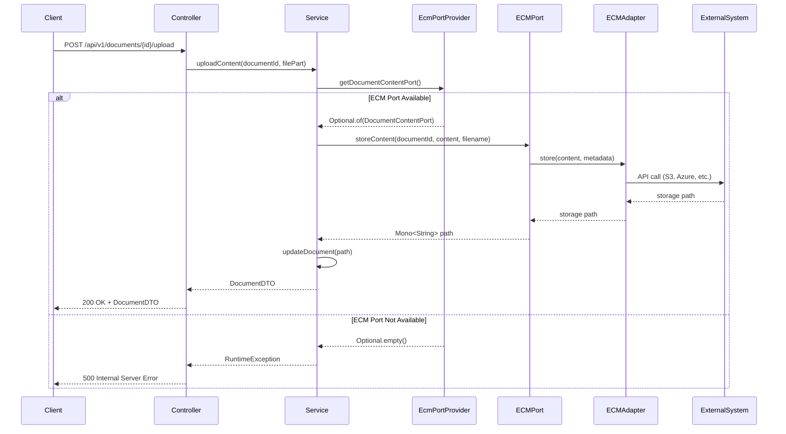

# Integration Overview

Comprehensive guide to fireflyframework-ecm-core integration for the Firefly OpenCore Platform Document Management Microservice.

## Integration Philosophy

The Document Management Microservice is designed around the principle of **graceful degradation** through fireflyframework-ecm-core integration. This means the service provides value at multiple levels:

1. **Standalone**: Document metadata management without content storage
2. **Partial ECM**: Some ECM capabilities (e.g., storage only)
3. **Full ECM**: Complete ECM functionality with all adapters

## EcmPortProvider Integration

### ECM Integration Flow



### Core Integration Component

The `EcmPortProvider` is the central component that provides access to ECM functionality:

```java
@Service
public class DocumentServiceImpl implements DocumentService {
    
    private final EcmPortProvider ecmPortProvider;
    
    public Mono<DocumentDTO> uploadContent(UUID documentId, FilePart filePart) {
        return repository.findById(documentId)
            .flatMap(document -> {
                return ecmPortProvider.getDocumentContentPort()
                    .map(port -> processWithEcm(document, filePart, port))
                    .orElseThrow(() -> new RuntimeException(
                        "Document content upload requires ECM DocumentContentPort to be configured"));
            });
    }
}
```

### Available ECM Ports

#### DocumentContentPort
**Purpose**: Content storage and retrieval operations

```java
Optional<DocumentContentPort> contentPort = ecmPortProvider.getDocumentContentPort();

if (contentPort.isPresent()) {
    // Store document content
    Mono<String> pathMono = contentPort.get()
        .storeContent(documentId, content, filename);

    // Retrieve content stream
    Mono<InputStream> streamMono = contentPort.get()
        .getContentStream(documentId);

    // Delete content
    Mono<Void> deleteMono = contentPort.get()
        .deleteContent(documentId);
}
```

#### SignatureRequestPort
**Purpose**: Digital signature request management

```java
Optional<SignatureRequestPort> signaturePort = ecmPortProvider.getSignatureRequestPort();

if (signaturePort.isPresent()) {
    // Create signature request
    Mono<String> requestMono = signaturePort.get()
        .createSignatureRequest(
            signatureId,
            documentId,
            "signer@getfirefly.io",
            "ELECTRONIC"
        );

    // Delete signature request
    Mono<Void> deleteMono = signaturePort.get()
        .deleteSignatureRequest(signatureRequestId);
}
```

#### DocumentSearchPort
**Purpose**: Document search and indexing operations

```java
Optional<DocumentSearchPort> searchPort = ecmPortProvider.getDocumentSearchPort();

if (searchPort.isPresent()) {
    // Index document for search
    Mono<Void> indexMono = searchPort.get()
        .indexDocument(documentId, content, metadata);

    // Search documents
    Mono<List<SearchResult>> searchMono = searchPort.get()
        .searchDocuments(query, filters);

    // Remove document from index
    Mono<Void> removeMono = searchPort.get()
        .removeFromIndex(documentId);
}
```

## Graceful Degradation Patterns

### Content Upload Pattern

```java
public Mono<DocumentDTO> uploadContent(UUID documentId, FilePart filePart) {
    return repository.findById(documentId)
        .switchIfEmpty(Mono.error(new DocumentNotFoundException(documentId)))
        .flatMap(document -> {
            return ecmPortProvider.getDocumentContentPort()
                .map(port -> {
                    // ECM available - store content externally
                    return DataBufferUtils.join(filePart.content())
                        .flatMap(dataBuffer -> {
                            byte[] content = new byte[dataBuffer.readableByteCount()];
                            dataBuffer.read(content);
                            DataBufferUtils.release(dataBuffer);
                            
                            return port.storeContent(documentId, content, filePart.filename())
                                .doOnSuccess(path -> {
                                    document.setContentPath(path);
                                    document.setFileName(filePart.filename());
                                    document.setMimeType(filePart.headers().getContentType().toString());
                                })
                                .then(repository.save(document))
                                .map(mapper::toDTO);
                        });
                })
                .orElseThrow(() -> new RuntimeException(
                    "Document content upload requires ECM DocumentContentPort to be configured"));
        });
}
```

### Signature Request Pattern

```java
public Mono<SignatureRequestDTO> createSignatureRequest(SignatureRequestDTO request) {
    return repository.findById(request.getDocumentId())
        .switchIfEmpty(Mono.error(new DocumentNotFoundException(request.getDocumentId())))
        .flatMap(document -> {
            SignatureRequest signatureRequest = mapper.toEntity(request);
            signatureRequest.setId(UUID.randomUUID());
            signatureRequest.setCreatedAt(LocalDateTime.now());
            
            return ecmPortProvider.getSignatureRequestPort()
                .map(port -> {
                    // ECM available - create external signature request
                    return port.createSignatureRequest(
                            signatureRequest.getId(),
                            document.getId(),
                            request.getSignerEmail(),
                            request.getSignatureType()
                        )
                        .doOnSuccess(externalId -> {
                            signatureRequest.setExternalRequestId(externalId);
                            signatureRequest.setSignatureStatus(SignatureStatus.SENT);
                        })
                        .doOnError(error -> {
                            log.error("Failed to create external signature request: {}", error.getMessage());
                            signatureRequest.setSignatureStatus(SignatureStatus.FAILED);
                        })
                        .onErrorReturn(signatureRequest.getExternalRequestId())
                        .then(Mono.just(signatureRequest));
                })
                .orElseGet(() -> {
                    // ECM unavailable - store request locally
                    signatureRequest.setSignatureStatus(SignatureStatus.PENDING);
                    log.warn("SignatureRequestPort not available, storing request locally");
                    return Mono.just(signatureRequest);
                })
                .flatMap(signatureRequestRepository::save)
                .map(mapper::toDTO);
        });
}
```

## Configuration Integration

### Business Logic vs Provider Configuration

The microservice maintains clear separation between configuration concerns:

#### Business Logic Configuration (Microservice Responsibility)
```yaml
firefly:
  ecm:
    integration:
      signature:
        custom-message: "Please review and sign this document"
        language: "en"
        signer-role: "Signer"
        expiration-days: 30
      document:
        security-level: "INTERNAL"
        retention-days: 2555
      error-handling:
        fail-fast: false
        log-failures: true
```

#### Provider Configuration (fireflyframework-ecm-core Responsibility)
```yaml
firefly:
  ecm:
    document-content:
      provider: s3
      s3:
        bucket: firefly-documents
        region: us-east-1
        access-key: ${AWS_ACCESS_KEY}
        secret-key: ${AWS_SECRET_KEY}
    
    signature:
      provider: docusign
      docusign:
        integration-key: ${DOCUSIGN_INTEGRATION_KEY}
        user-id: ${DOCUSIGN_USER_ID}
        account-id: ${DOCUSIGN_ACCOUNT_ID}
```

## Deployment Scenarios

### 1. Standalone Deployment
**Configuration**: No ECM adapters
**Capabilities**: Document metadata management only
**Use Case**: Development, testing, or minimal document tracking

```yaml
# No ECM configuration needed
firefly:
  ecm:
    integration:
      error-handling:
        fail-fast: false
        log-failures: true
```

### 2. Local Storage Deployment
**Configuration**: Local file system adapter
**Capabilities**: Document storage and retrieval
**Use Case**: Development, single-server deployments

```yaml
firefly:
  ecm:
    document-content:
      provider: local
      local:
        base-path: ./documents
        create-directories: true
```

**Required Dependency**:
```xml
<dependency>
    <groupId>com.firefly</groupId>
    <artifactId>fireflyframework-ecm-adapter-local</artifactId>
    <version>${firefly.version}</version>
</dependency>
```

### 3. Cloud Storage Deployment
**Configuration**: S3 or Azure Blob adapter
**Capabilities**: Scalable document storage
**Use Case**: Production deployments

```yaml
firefly:
  ecm:
    document-content:
      provider: s3
      s3:
        bucket: firefly-documents-prod
        region: us-east-1
        access-key: ${AWS_ACCESS_KEY}
        secret-key: ${AWS_SECRET_KEY}
```

**Required Dependency**:
```xml
<dependency>
    <groupId>com.firefly</groupId>
    <artifactId>fireflyframework-ecm-adapter-s3</artifactId>
    <version>${firefly.version}</version>
</dependency>
```

### 4. Full ECM Deployment
**Configuration**: Storage + signature adapters
**Capabilities**: Complete ECM functionality
**Use Case**: Enterprise production deployments

```yaml
firefly:
  ecm:
    document-content:
      provider: s3
      s3:
        bucket: firefly-documents-prod
        region: us-east-1
    
    signature:
      provider: docusign
      docusign:
        integration-key: ${DOCUSIGN_INTEGRATION_KEY}
        user-id: ${DOCUSIGN_USER_ID}
        account-id: ${DOCUSIGN_ACCOUNT_ID}
```

**Required Dependencies**:
```xml
<dependency>
    <groupId>com.firefly</groupId>
    <artifactId>fireflyframework-ecm-adapter-s3</artifactId>
    <version>${firefly.version}</version>
</dependency>
<dependency>
    <groupId>com.firefly</groupId>
    <artifactId>fireflyframework-ecm-adapter-docusign</artifactId>
    <version>${firefly.version}</version>
</dependency>
```

## Health Monitoring

### ECM Integration Health Check

```java
@Component
public class EcmHealthIndicator implements HealthIndicator {
    
    private final EcmPortProvider ecmPortProvider;
    
    @Override
    public Health health() {
        Health.Builder builder = new Health.Builder();
        
        boolean hasContentPort = ecmPortProvider.getDocumentContentPort().isPresent();
        boolean hasVersionPort = ecmPortProvider.getDocumentVersionPort().isPresent();
        boolean hasSignaturePort = ecmPortProvider.getSignatureRequestPort().isPresent();
        boolean hasEnvelopePort = ecmPortProvider.getSignatureEnvelopePort().isPresent();
        
        builder.withDetail("documentContentPort", hasContentPort ? "available" : "not available");
        builder.withDetail("documentVersionPort", hasVersionPort ? "available" : "not available");
        builder.withDetail("signatureRequestPort", hasSignaturePort ? "available" : "not available");
        builder.withDetail("signatureEnvelopePort", hasEnvelopePort ? "available" : "not available");
        
        if (hasContentPort || hasVersionPort || hasSignaturePort || hasEnvelopePort) {
            builder.up();
        } else {
            builder.down().withDetail("reason", "No ECM ports available");
        }
        
        return builder.build();
    }
}
```

### Debug Endpoints

```java
@RestController
@RequestMapping("/debug")
public class EcmDebugController {
    
    private final EcmPortProvider ecmPortProvider;
    
    @GetMapping("/ecm-ports")
    public Map<String, Boolean> getEcmPortStatus() {
        return Map.of(
            "documentContentPort", ecmPortProvider.getDocumentContentPort().isPresent(),
            "documentVersionPort", ecmPortProvider.getDocumentVersionPort().isPresent(),
            "signatureRequestPort", ecmPortProvider.getSignatureRequestPort().isPresent(),
            "signatureEnvelopePort", ecmPortProvider.getSignatureEnvelopePort().isPresent()
        );
    }
}
```

## Error Handling

### ECM Operation Error Handling

```java
public Mono<DocumentDTO> downloadContent(UUID documentId) {
    return repository.findById(documentId)
        .switchIfEmpty(Mono.error(new DocumentNotFoundException(documentId)))
        .flatMap(document -> {
            return ecmPortProvider.getDocumentContentPort()
                .map(port -> {
                    return port.getContentStream(documentId)
                        .doOnError(error -> log.error("ECM content retrieval failed: {}", error.getMessage()))
                        .onErrorMap(throwable -> new EcmOperationException("Failed to retrieve content", throwable));
                })
                .orElseThrow(() -> new RuntimeException(
                    "Document content download requires ECM DocumentContentPort to be configured"));
        });
}
```

### Configuration Validation

```java
@EventListener(ApplicationReadyEvent.class)
public void validateEcmIntegration() {
    log.info("ECM Integration Status:");
    
    ecmPortProvider.getDocumentContentPort()
        .ifPresentOrElse(
            port -> log.info("  DocumentContentPort available"),
            () -> log.warn("  DocumentContentPort not available - content operations disabled")
        );
    
    ecmPortProvider.getSignatureRequestPort()
        .ifPresentOrElse(
            port -> log.info("  SignatureRequestPort available"),
            () -> log.warn("  SignatureRequestPort not available - signature operations disabled")
        );
}
```

## Best Practices

1. **Always check ECM port availability** before attempting operations
2. **Implement graceful degradation** for missing ECM functionality
3. **Use proper error handling** with meaningful messages
4. **Separate business logic** from provider configuration
5. **Monitor ECM integration health** continuously
6. **Test with and without** ECM adapters configured
7. **Follow reactive programming** patterns consistently
8. **Implement comprehensive logging** for troubleshooting
